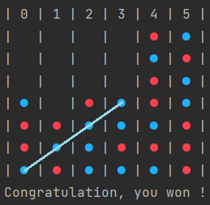

# Power 4 / Connect Four

Object: Connect four of your checkers in a row while preventing your opponent from doing the same. 
But, look out – your opponent can sneak up on you and win the game!

> Milton Bradley, Connect Four "Pretty Sneaky, Sis" television commercial, 1977

## Visual appearance

## Authors
- Guillaume Gonin
- Robin Forestier

## How to use
1. Clone the repos: `git clone https://github.com/HEIGVD-PRG1-F-2022/lab-03-puissance-4-guillaume-g-robin-f.git`
2. Compile the project: `g++ *.cpp -o ./main`
3. Execute the binary: `./main`

The project can be developed and compiled with CLion too.

## Review of the teacher
The code review and faculative grade is available here: [review](https://github.com/HEIGVD-PRG1-F-2022/lab-03-puissance-4-guillaume-g-robin-f/pull/1)